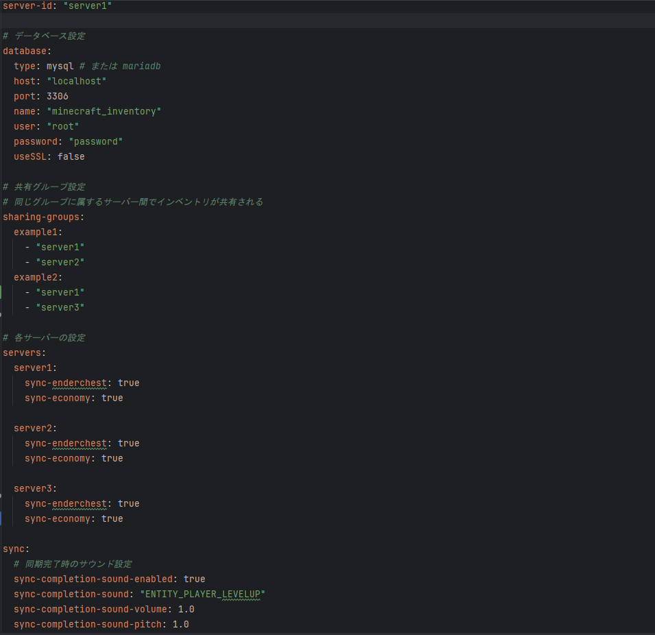

# Inventory_Share
A plugin for sharing player data between servers using a database.  
It can synchronize inventory, ender chest, and economy data from Vault-compatible plugins.

**Tested Minecraft Version:** 1.21.1
<br>(日本語の説明は[こちら](JP_README.md)からご覧になれます。)
# How to Use
**① Install this plugin on all servers where you want to share data.**  
<br>On the first launch after installation, the server will shut down once because the database settings are not configured yet.

**② Open the plugin's configuration file from the <code>plugins</code> folder and set up your database information.**

**③ While keeping the config file open, change the <code>server-id</code> to a unique identifier.**  
<br>Remember the <code>server-id</code> you set, as you will use it in other settings.

**④ Configure the <code>sharing-groups</code>.**  
<br>Using the server IDs set in step ③, group the servers you want to share data between.  
<br>For example, to share data between servers with IDs <code>s1</code> and <code>s2</code>, configure it like this:
```
sharing-groups:
example1:
- "s1"
- "s2"
```

**⑤ Specify which data types to synchronize on each server.**  
<br>Using the server IDs again, configure what data to share.  
<br><code>sync-enderchest</code> is for ender chest sharing, and <code>sync-economy</code> is for economy plugin data sharing.  
<br>(Inventory data is shared by default.)  
<br><br>That’s it! Save the config file and start your server.

<br><br>**Example Configuration (Default)**


# Notes
- If the server fails to connect to the database during startup for any reason, it will shut down automatically as a safety measure.
- If you downgrade your server version, **item IDs may not be retrieved correctly, which can result in all inventory data being reset.** (Upgrading versions does not cause issues.)
- We are not responsible for any problems or damages caused by using this plugin.

# Support
If you encounter bugs or have feature requests, please contact us via our dedicated Discord server.  
<br>URL: https://discord.gg/xcFfNgYaQF
